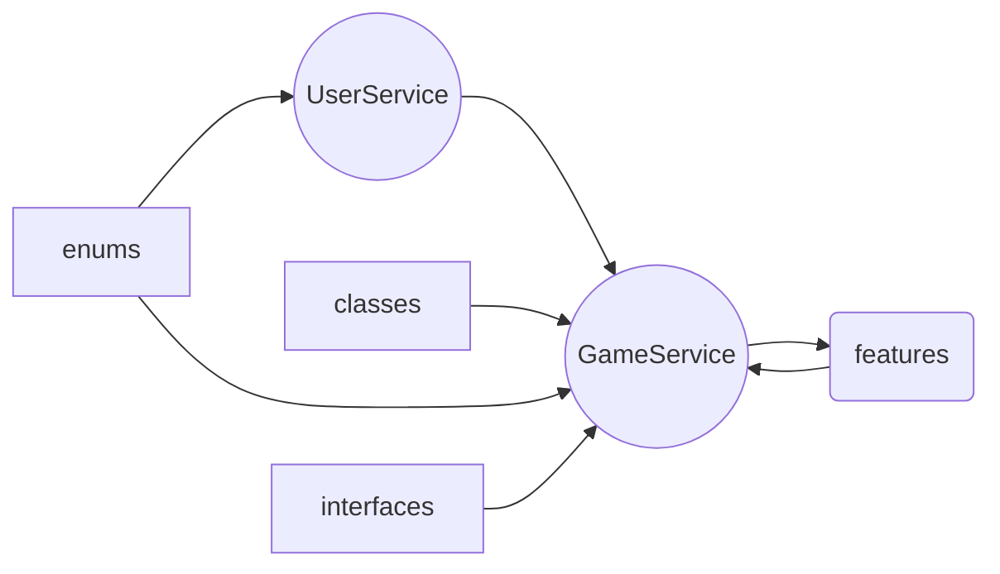
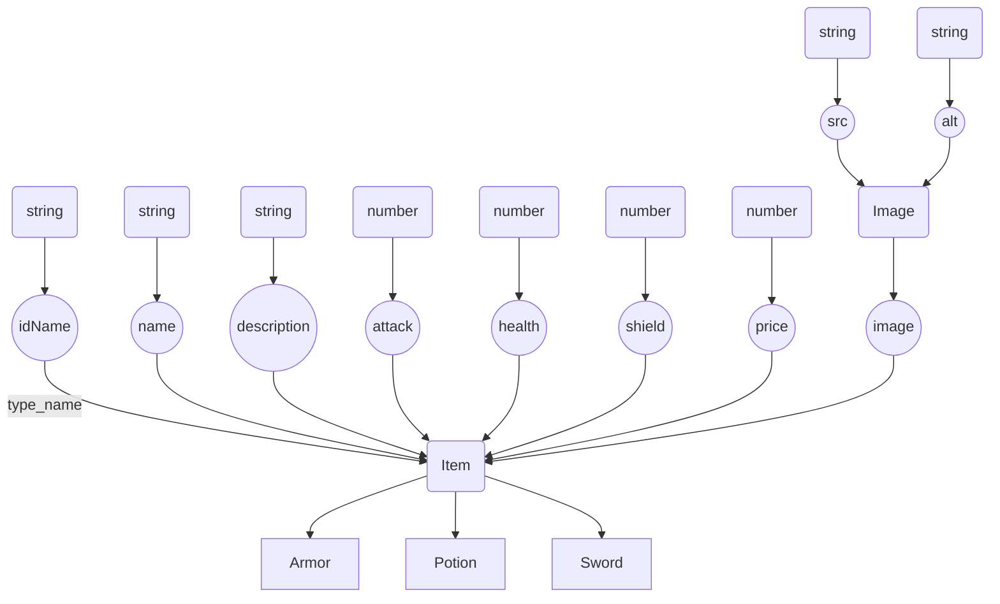
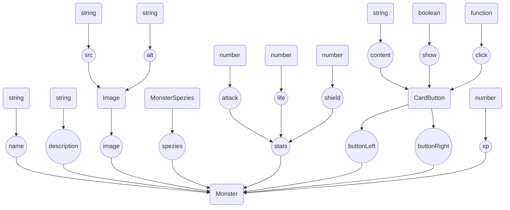

# Fightgame

This project was generated with [Angular CLI](https://github.com/angular/angular-cli) version 13.0.3.

## Project

## Classes

## List of all Items

### Swords
- sword_wood
- sword_stone
- sword_copper
- sword_iron
- sword_gold

### Armors
- armor_leather
- armor_wood
- armor_copper
- armor_iron
- armor_gold
- armor_rubber

### Potions
- potion_heal
- potion_strength